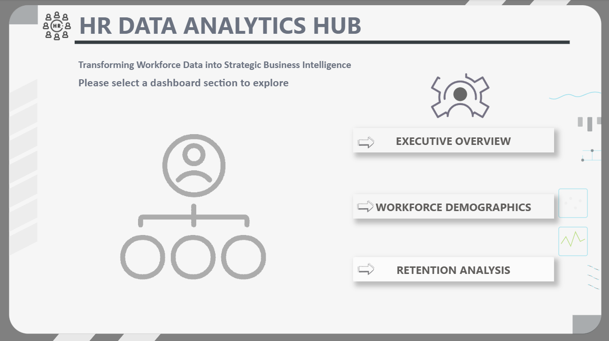
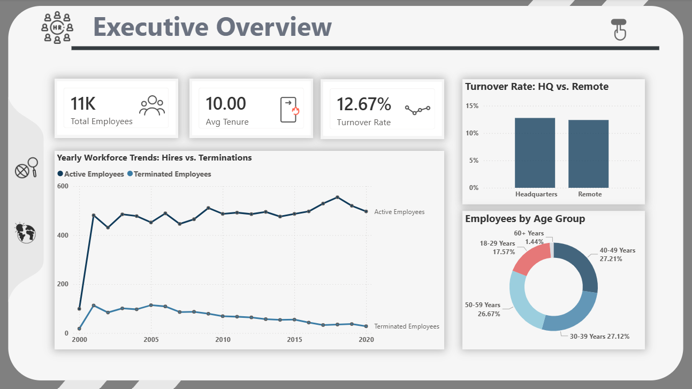
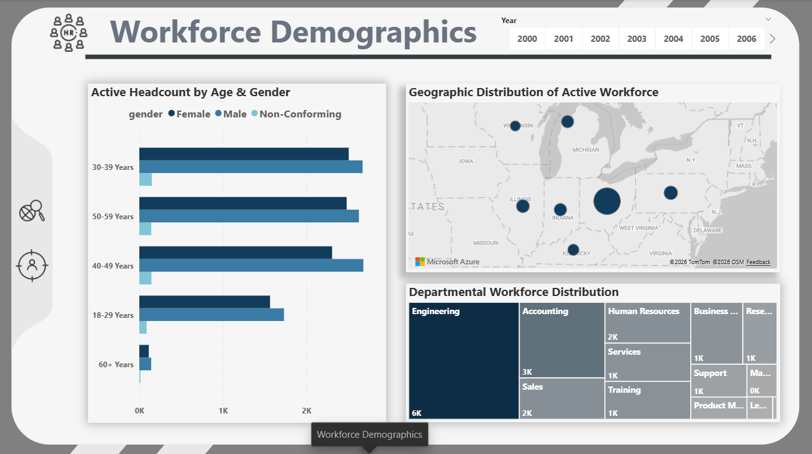
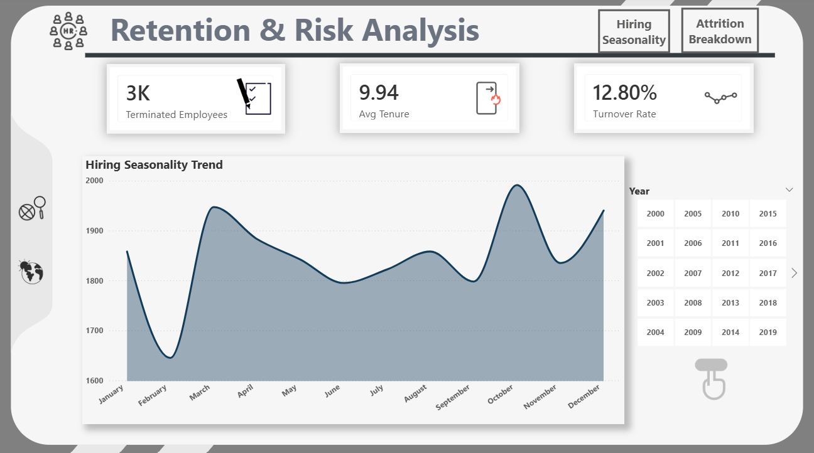
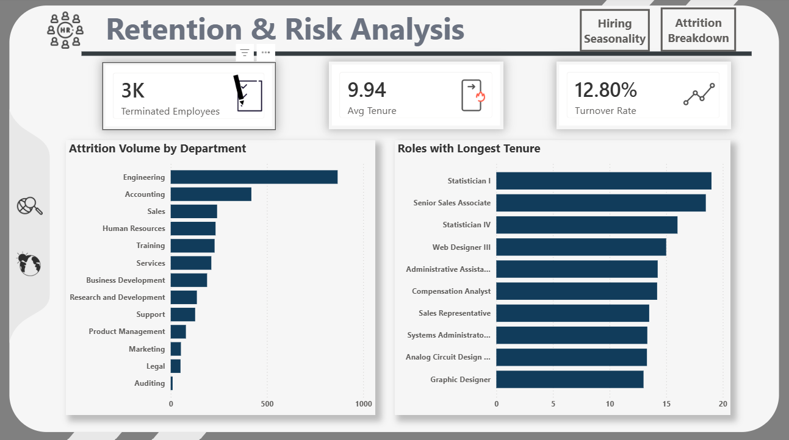

# 👥 HR Data Analysis — End-to-End Pipeline

> **SQL → Python → Power BI** | Data Cleaning · Feature Engineering · EDA · Dashboard

---

## 🚨 The Business Problem

Despite **two decades of continuous organizational growth**, the company's executive leadership and HR department have been making talent management decisions based on **intuition rather than data**. Thousands of employee records existed — yet there was zero visibility into critical workforce metrics.

The company was silently facing **three hidden business risks:**

| # | Risk | Impact |
|---|---|---|
| 1 | **Unidentified Attrition** | Unable to pinpoint which departments suffer from high turnover — brain drain goes undetected |
| 2 | **Inefficient Recruitment** | No understanding of hiring seasonality → misallocated budgets & overwhelmed onboarding teams |
| 3 | **Workforce Fragmentation** | Blind spots on demographic makeup and HQ vs. Remote retention differences |

---

## 🎯 The Objective

Build an **end-to-end Data Analytics Pipeline** (SQL → Python → Power BI) to transition the company from *reactive* HR administration to *proactive*, data-driven talent strategy.

By extracting, cleaning, and analyzing **22,000+ employee records**, this project aims to:

- Uncover retention bottlenecks and highlight high-risk departments
- Map the exact geographic and demographic distribution of the workforce
- Identify actionable hiring seasonality trends to optimize annual recruitment budgets
- Deliver an interactive executive dashboard that empowers leadership to monitor workforce health instantly

---

## ✅ Did We Achieve the Objective?

| Goal | Outcome | Key Finding |
|---|---|---|
| Identify high-risk attrition | ✅ Achieved | `Auditing` dept: **19.23% turnover** — nearly 1 in 5 employees lost |
| Uncover hiring seasonality | ✅ Achieved | Peak months: **March & October** · Slowest: **February** |
| Map workforce distribution | ✅ Achieved | **Ohio hyper-centralization** — 14,700+ HQ + ~3,500 "remote" all in same state |
| HQ vs. Remote retention | ✅ Achieved | Turnover rates nearly identical → remote workforce is NOT a flight risk |
| Executive dashboard | ✅ Achieved | 4-page interactive Power BI report with Bookmarks, Tooltips & Azure Maps |
| Overall retention health | ✅ Healthy | **12.80% turnover** within benchmark · **9.94 yr avg tenure** |

---

## 📌 Project Overview

A complete HR analytics pipeline built on a real-world human resources dataset. The project spans three stages — raw data cleaning in SQL, exploratory analysis in Python, and executive-level visualization in Power BI — reflecting a production-grade data workflow.

The dataset contains **22,000+ employee records** with fields covering demographics, hire/termination dates, department, location, job title, and more.

---

## 🗂️ Project Structure

```
HR-Data-Analysis-End-to-End/
│
├── screenshots/
├── Human Resources.csv              # data
├── DataCleaning_Using_SQL.sql       # Full SQL cleaning & feature engineering script
├── Analysis_Using_SQL_in_Python.ipynb  # Python EDA notebook (SQL + Pandas + Viz)
├── hrDashboard.pbix                 # Power BI interactive dashboard
└── README.md
```

---

## 🔧 Phase 1 — Data Cleaning (SQL)

**Tool:** MySQL

All raw data issues were resolved before loading into any BI tool — keeping the Power BI dashboard lightweight and fast.

### Key challenges tackled:

| Problem | Solution |
|---|---|
| Malformed column name (`id`) | `ALTER TABLE` → renamed to `employee_id` |
| Duplicate primary key check | `GROUP BY` + `HAVING COUNT(*) > 1` → ✅ No duplicates |
| Mixed date formats (`/` vs `-`) | `CASE` + `STR_TO_DATE` + `DATE_FORMAT` |
| Dirty `termdate` (UTC strings, empty strings, `0000-00-00`, NULLs) | `SAVEPOINT` → multi-step parse → `NULL` standardization |
| Century bug (future birthdates) | `DATE_SUB(..., INTERVAL 100 YEAR)` for `birthdate > CURDATE()` |

### Feature Engineering added in SQL:

- **`age`** — calculated via `TIMESTAMPDIFF(YEAR, birthdate, CURDATE())`
- **`tenure`** — years between hire date and termination (or today)
- **`future_term`** — binary flag for employees with upcoming contract end dates
- **`employment_status`** — `Active` vs `Terminated` derived from `termdate`

### Data Validation (QA):

```sql
-- Age sanity check
SELECT MIN(age), MAX(age), ROUND(AVG(age)) FROM humanresources;

-- Underage check → should return 0
SELECT COUNT(*) FROM humanresources WHERE age < 18;

-- Future terminations flagged
SELECT COUNT(*) FROM humanresources WHERE termdate > CURDATE(); -- 1,085 employees
```

---

## 🐍 Phase 2 — Exploratory Analysis (Python)

**Tool:** Jupyter Notebook · Pandas · Matplotlib / Seaborn · ipython-sql · PyMySQL · SQLAlchemy

The cleaned SQL data was queried directly inside Python using `ipython-sql` + `PyMySQL`, enabling native SQL execution inside Jupyter without CSV exports.

> ⚠️ **Dependency note:** A version conflict was resolved by downgrading `prettytable` to `2.5.0` to ensure compatibility with `ipython-sql`.

The analysis was structured across **6 phases covering 18 business questions:**

---

### Phase 2.1 — Employee Demographics & Diversity

- Gender split: Male (9,858) · Female (8,975) · Non-Conforming (537)
- Racial distribution: White is the single largest group (5,514), but combined minority groups form the majority — strong diversity profile
- Age range validated: 23–60 → confirms the Century Bug fix was fully successful
- Workforce is mid-career heavy: age brackets 25–34, 35–44, 45–54 are each ~6,000 employees

**Business Recommendations:**
- Launch succession planning & leadership programs for the dominant 25–54 cohort
- Leverage racial diversity actively in employer branding
- Investigate gender parity at the department and leadership level

---

### Phase 2.2 — Organizational Structure

- **Engineering** is the largest department: 5,819 active employees — double the next largest (Accounting: 2,914)
- Top roles: `Research Assistant II` and `Business Analyst` — signals a data/research-driven business model
- Lean support functions: `Auditing` (42) and `Legal` (260) are at risk of burnout relative to their workloads

**Business Recommendations:**
- Assign dedicated HR Business Partners to Engineering and Accounting clusters
- Build clear promotion tracks (Senior → Lead → Principal) for high-volume roles

---

### Phase 2.3 — Geographic Distribution

- HQ in Cleveland, Ohio: 14,700+ active employees
- "Remote" workforce is largely local: ~3,500 Ohio-based remote workers → hybrid, not truly distributed
- Out-of-state presence is thin and scattered: Chicago and Philadelphia host only ~30–35 remote workers each

**Business Recommendations:**
- Treat Ohio remote workers as near-HQ hybrid staff — engage them via quarterly on-site events
- Address single-state concentration risk: build disaster recovery plans for Ohio-region disruptions
- Offer co-working stipends to isolated out-of-state employees

---

### Phase 2.4 — Turnover & Retention

- Overall turnover rate: **12.80%** — within the healthy 10–15% benchmark
- Average tenure at exit: **7.88 years** — exceptionally high, indicating strong employee loyalty
- `Sales` has the highest average tenure: ~8.78 years
- 🚨 `Auditing` department red flag: **19.23% turnover** despite being only 52 employees total

**Business Recommendations:**
- Immediate exit interview and workload audit for the Auditing team
- Implement knowledge transfer programs to capture institutional knowledge from long-tenured employees
- Study and replicate the Sales department's retention model across high-attrition teams

---

### Phase 2.5 — Hiring Trends & Seasonality

- **20 consecutive years** of positive net headcount growth — not a single year where terminations exceeded hires
- Terminations dropped sharply over the last decade (down to 51 in 2020)
- Peak hiring months: **October, December (Q4)** and **March (Q1)**
- Slowest hiring month: **February**

**Business Recommendations:**
- Pre-scale onboarding resources in September and February, ahead of the Q4 and Q1 hiring spikes
- Concentrate recruitment marketing spend before peak seasons to maximize ROI

---

## 📊 Phase 3 — Power BI Dashboard

**Tool:** Power BI Desktop (`.pbix`) · DAX · Bookmarks · Selections · Tooltips

The dashboard was designed to be **fast and lightweight** — all heavy calculations were done upstream in SQL to avoid slow DAX computed columns and keep the `.pbix` responsive.

---

### Dashboard Structure — 4 Pages

#### 🏠 Navigation Page
A custom landing hub with button-based navigation routing users to each section — built using **Bookmarks + Selection pane** to simulate page-switching without actual page navigation.

#### 📋 Executive Overview
Top-level KPI cards with cross-filter slicers (Department / Location / Gender):
- **Total Employees · Avg Tenure · Turnover Rate**
- Yearly Workforce Trend: Hires vs. Terminations (2000–2020)
- Turnover Rate: HQ vs. Remote (bar chart)
- Employees by Age Group (donut chart)
- **Custom Tooltip:** Hovering on the age donut reveals a *Terminated Employees by Age Group* breakdown — built using a dedicated hidden tooltip page

#### 👥 Workforce Demographics
- Active Headcount by Age Group & Gender (clustered bar chart)
- Geographic Distribution of Active Workforce (Azure Maps visual)
- Departmental Workforce Distribution (treemap — Engineering dominates at 6K)
- Year slicer for time-based filtering across all visuals

#### 📉 Retention & Risk Analysis
Two sub-views toggled via **Bookmarks**:

| View | Content |
|---|---|
| **Hiring Seasonality** | Area chart of monthly hiring volume — peaks in March & October, trough in February |
| **Attrition Breakdown** | Attrition Volume by Department + Roles with Longest Tenure (bar charts) |

KPI cards persist across both views: **3K Terminated · 9.94 Avg Tenure · 12.80% Turnover Rate**

---

### DAX Measures — Organized in Folders

```
Measures_/
├── Demographics & Diversity
│   ├── Avg Age
│   ├── Avg Tenure
│   └── Female Diversity %
├── Headcount & Turnover
│   ├── Active Employees
│   ├── Terminated Employees
│   ├── Total Hires
│   ├── Total Employees
│   └── Turnover Rate
├── Time Intelligence
│   ├── Hires Last Year
│   └── YoY Hiring Growth %
└── Work Environment
```

---

### Advanced Power BI Techniques Used

| Technique | Where Applied |
|---|---|
| **Bookmarks + Selection Pane** | Navigation hub & Seasonality ↔ Attrition toggle |
| **Custom Tooltip Page** | Terminated Employees by Age Group on hover |
| **DAX Measure Folders** | Organized into 4 logical folders for maintainability |
| **Azure Maps Visual** | Geographic distribution of active workforce |
| **Cross-filter Slicers** | Department / Location / Gender across Executive Overview |

---

## 🖼️ Dashboard Screenshots

### 🏠 Navigation Page

> Custom landing hub with Bookmarks + Selection pane for smooth page routing.

### 📋 Executive Overview

> KPI cards + Hires vs. Terminations trend (2000–2020) + HQ vs. Remote turnover + Age group donut with custom tooltip.

### 👥 Workforce Demographics

> Age & gender breakdown + Azure Maps geographic distribution + Department treemap.

### 📉 Retention & Risk — Hiring Seasonality

> Monthly hiring volume area chart — March & October peaks clearly visible.

### 📉 Retention & Risk — Attrition Breakdown

> Attrition by department + Roles with longest tenure — Auditing red flag visible at bottom.

> **💡 Note:** Create a `screenshots/` folder in the repo root and upload the dashboard images with the filenames above.

---

## 🛠️ Tech Stack

| Layer | Tool |
|---|---|
| Data Cleaning | MySQL 8.0 |
| Analysis | Python 3, Pandas, Matplotlib, Plotly, Jupyter |
| Visualization | Power BI Desktop |

---

## 💡 Key Decisions & Lessons Learned

- **Feature engineering in SQL, not Power BI** — avoids DAX overhead and keeps the `.pbix` file responsive
- **SAVEPOINT pattern** — used during the tricky `termdate` parsing to allow safe rollback across multi-step transformations
- **Century bug fix** — future birthdates caused by 2-digit year imports were corrected by subtracting 100 years, not by patching downstream calculations
- **NULL standardization** — multiple null representations (`''`, `' '`, `'0000-00-00'`, `NULL`) were unified before column type conversion

---

## 🚀 How to Run

1. Import `DataCleaning_Using_SQL.sql` into a MySQL database named `hrData`
2. Load your raw CSV into a table named `humanresources`
3. Run the SQL script top-to-bottom
4. Open `Analysis_Using_SQL_in_Python.ipynb` and update your DB connection string
5. Open `hrDashboard.pbix` in Power BI Desktop and refresh the data source

---

## 📬 Connect

Feel free to reach out on [LinkedIn](https://www.linkedin.com/in/samir-hendawy-530124231/) if you have questions or feedback!
